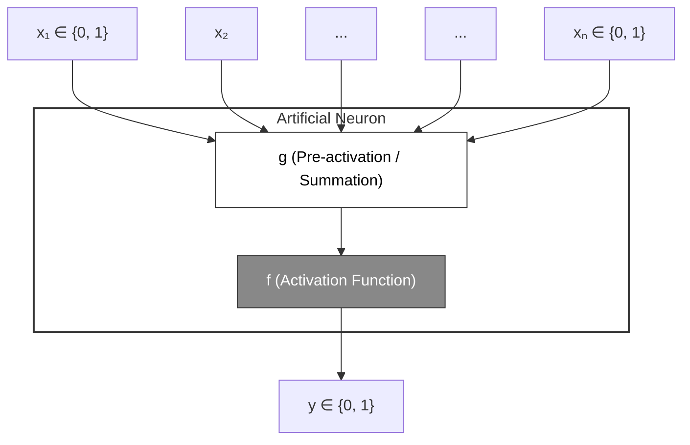

McCulloch (neuroscientist) and Pitts (logician) proposed a highly simplified computational model of the neuron (1943)

 **g** = aggregates the inputs 
 **f** = takes a decision based on this aggregation of function **g**
