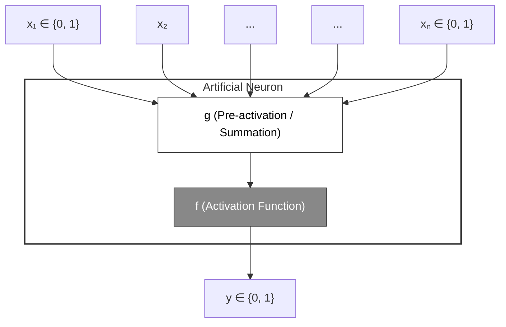

McCulloch (neuroscientist) and Pitts (logician) proposed a highly simplified computational model of the neuron (1943)

 - **g** = aggregates the inputs 
 - **f** = takes a decision based on this aggregation

 - weight associated with communication links may be excitatory(+ve) or inhabihary(-ve)
 - In the perceptron model, excitatory inputs promote the activation of the neuron, while inhibitory inputs oppose it.
------------------------------
## Key Differences

| Feature | Excitatory Inputs | Inhibitory Inputs |
|---|---|---|
| Mathematical Sign | Positive (w > 0) | Negative (w < 0) |
| Effect on Net Input | Increases the weighted sum. | Decreases the weighted sum. |
| Effect on Activation | Pushes the neuron closer to its activation threshold. | Pulls the neuron away from its activation threshold. |
| Biological Analogy | Neurotransmitters that encourage a neuron to fire  | Neurotransmitters that prevent a neuron from firing|

## A Simple Analogy
Imagine deciding whether to go to an outdoor concert (the neuron firing).

* Excitatory input: "Your favorite band is playing" has a positive weight. It heavily pushes you toward going.
* Inhibitory input: "It is raining heavily" has a negative weight. It strongly drags down your motivation, potentially canceling out the excitement of the band and keeping you at home.

$$\theta > n w - p$$

*(where w = excitatory weight, p = inhibitory weight)*

