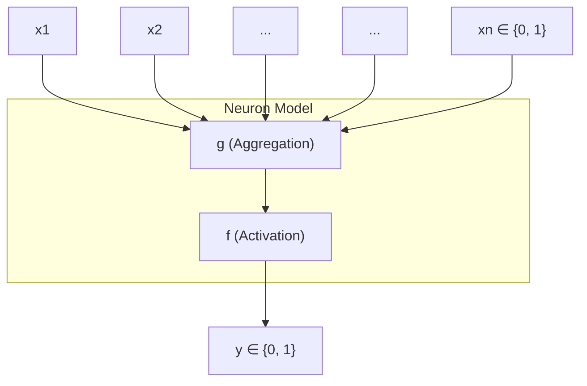

McCulloch (neuroscientist) and Pitts (logician) proposed a highly simplified computational model of the neuron (1943)

  **g** aggregates the inputs and the function **f** takes a decision based on this aggregation

\end{tikzpicture}
\end{document}
